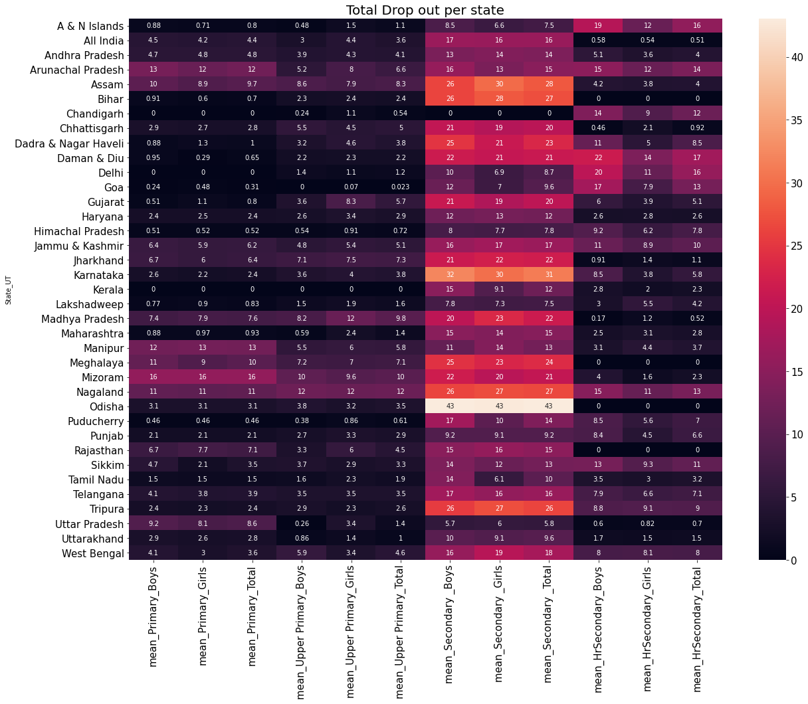
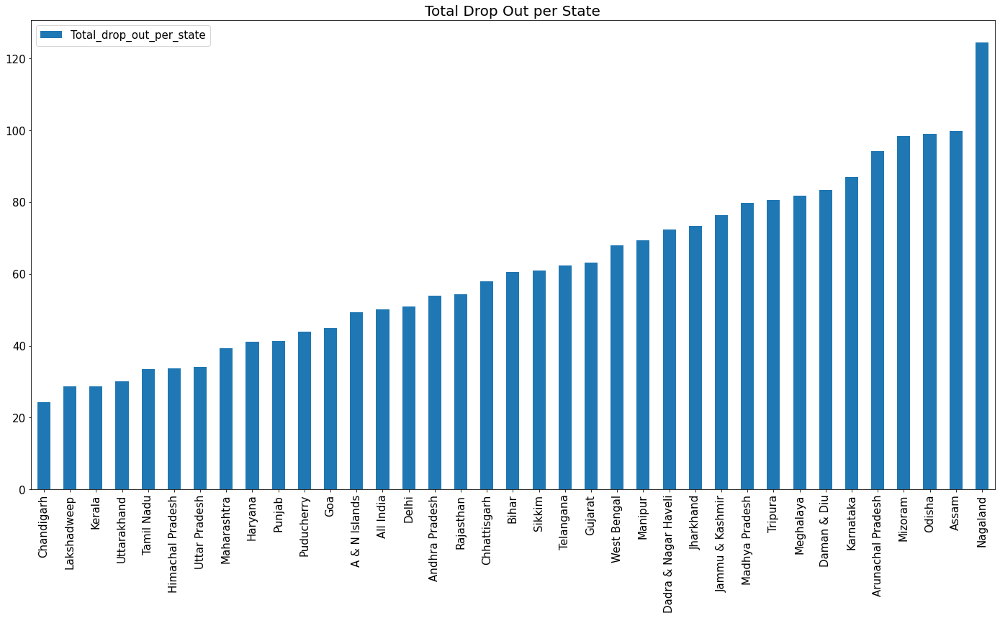
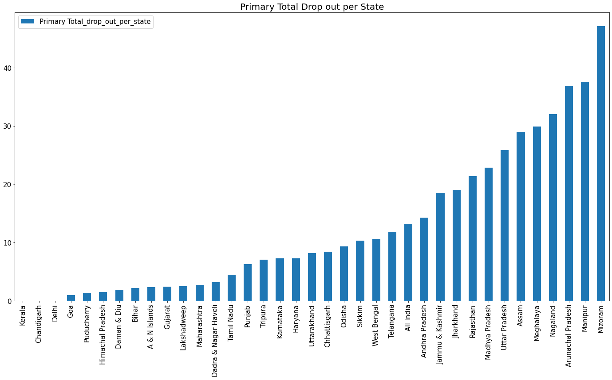
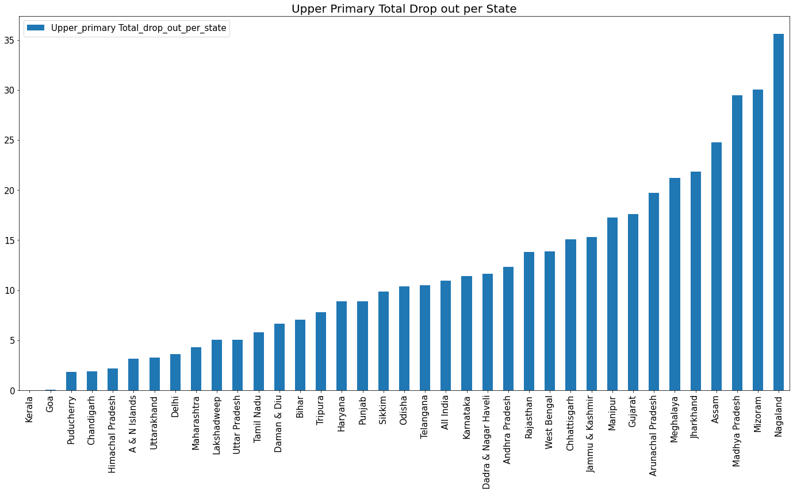
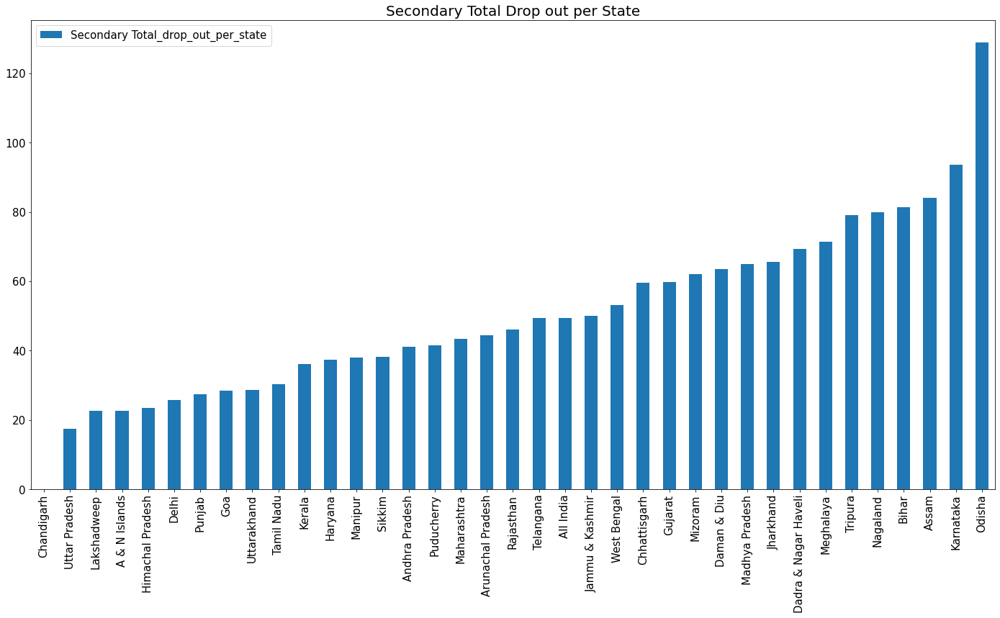
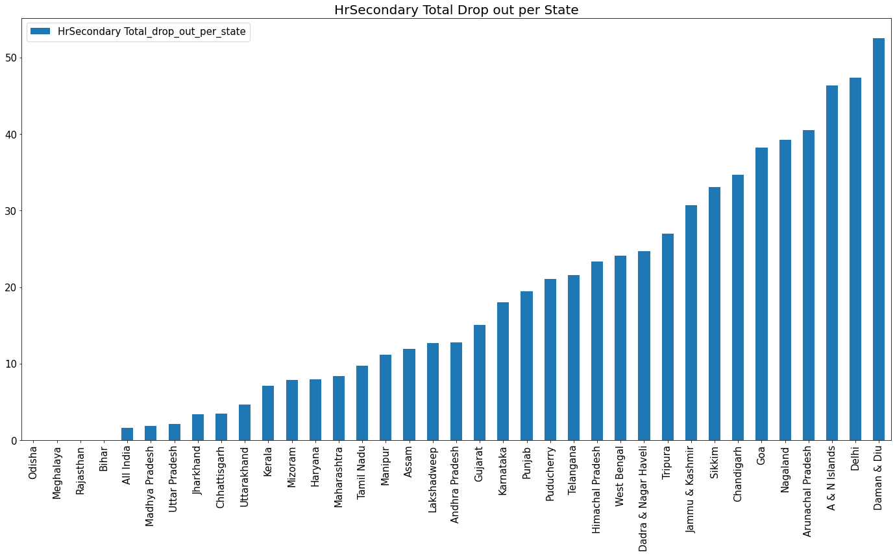
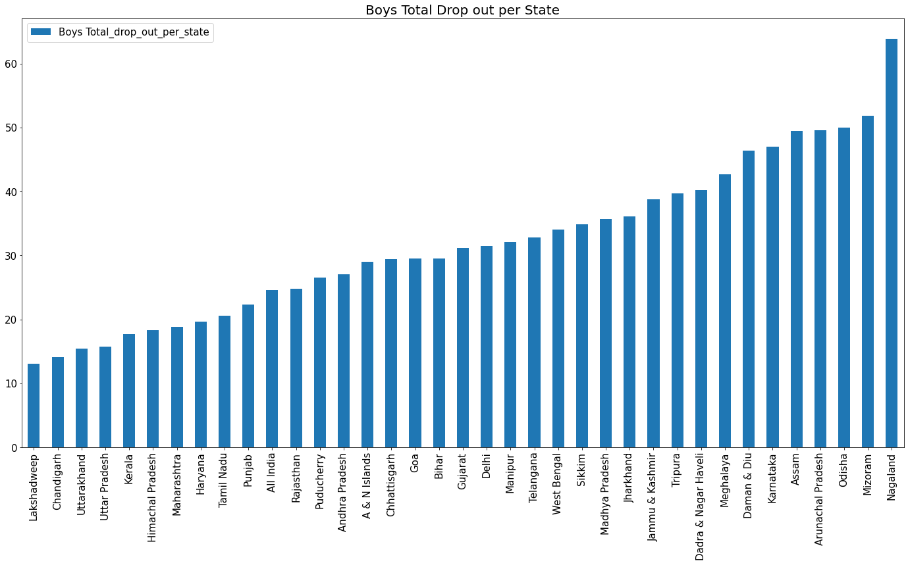
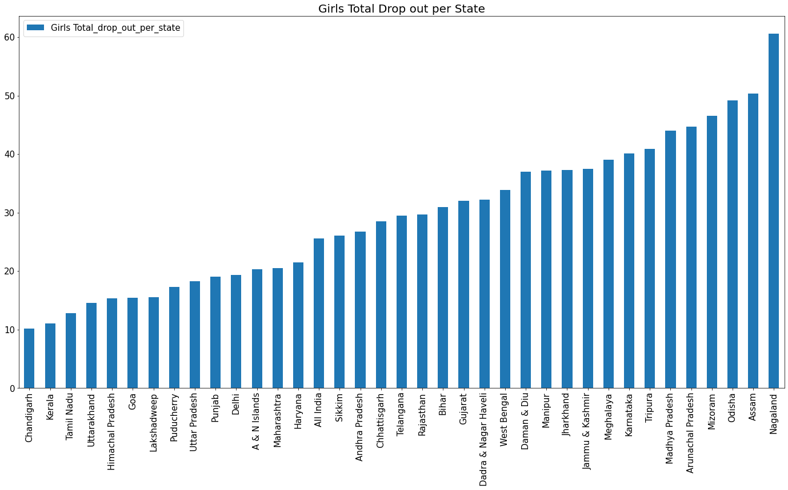
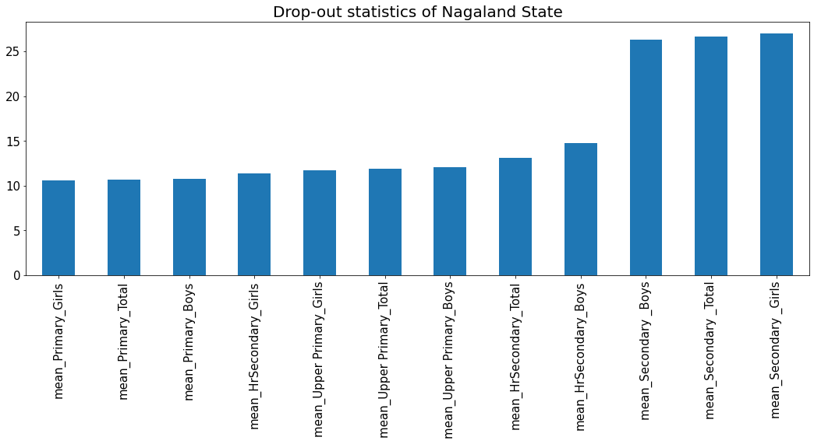

## Which states have the highest Dropout Ratio?

Let's explore the Drop-out Table from the Indian School Eduation [Dataset](https://www.kaggle.com/vidyapb/indian-school-education-statistics) and answer the question above.

  
Heatmap of <b>Total</b> Dropout per State

  <!-- Provide path to the screenshot here-->
    

  

    <h4> From the heatmap above, we may be tempted to conclude that "Odisha" state has the highest school drop out rate. But let's not jump into comclusion yet !!! Secondary school students have the overall highest average of drop-outs and the indian government should look into this</h4>
  

  
Bar Chart of <b>Total</b> dropout per state

  <!-- Provide path to the screenshot here-->
    

  

    <h4> The summed total of dropouts across all student category type is used to generate the barchart in the drop-down above.</h4>
    <h4> From the bar chart we can see clearly that, 'Nagaland' has the highest global average of dropouts in all Student category type,  while 'odisha' state has the highest local average of dropouts in the secondary school section from the heatmap. </h4>
    <h4> The Indian Government should look into the secondary schools in 'Odisha' and also look at all Schools in 'Nagaland' as they have the highest drop out rates overall <h4>
  

  
Bar Chart of Dropouts in <b>Primary Student</b> Category

  <!-- Provide path to the screenshot here-->
    

  

    <h4> From the bar chart above we can conclude that 'Mizoram' state has the highest drop out in the Primary Student category, while 'Kerala, Chandigarh and Delhi' states have the least drop out in the primary Student category of 0 </h4>
  

  
Bar Chart of Dropouts in <b>Upper Primary Student</b> Category

  <!-- Provide path to the screenshot here-->
    
  
  

    <h4> From the bar chart above we can conclude that Nagaland' state has the highest drop out in the Upper Primary Student category, while 'Kerala' state has the least drop out in the Upper primary Student category of 0 </h4>
  

  
Bar Chart of Dropouts in <b>Secondary Student</b> Category

  <!-- Provide path to the screenshot here-->
    
  
  

    <h4> From the bar chart above we can conclude that 'Odisha' state has the highest drop out in the Secondary Student category, while 'Chandigarh' state has the least drop out in the Secondary Student category of 0</h4>
  

  
Bar Chart of Dropouts in <b>HrSecondary Student</b> Category

  <!-- Provide path to the screenshot here-->
    

  

    <h4> From the bar chart above we can conclude that 'Daman & Diu' state has the highest drop out in the HrSecondary Student category, while 'Odisha, Meghalaya Rajasthan Bihar' states have the least drop out in the HrSecondary Student category of 0</h4>
  

  
Bar Chart of Dropouts among the <b>Male Gender</b> across states

  <!-- Provide path to the screenshot here-->
    

  

    <h4> From the bar chart above we can see that 'Lakshadweep' state has the least dropout rate for boys and 'Nagaland' has the heighest dropout rate.</h4>
  

  
Bar Chart of Dropouts among the <b>Female Gender</b> across states

  <!-- Provide path to the screenshot here-->
    

  

    <h4> From the bar chart above we can see that 'Chandigarh' state has the least dropout rate for girls and 'Nagaland' has the heighest dropout rate for girls.</h4>
  

  
Bar Chart of Dropouts in the <b>state with the Highest Drop-out rate</b> 

  <!-- Provide path to the screenshot here-->
    

  

    <h4> From the Bar chart above, we see that the secondary student category has the highest dropout rate in Nagaland state, while the dropout rate for primary, upper primary  and HrSecondary categories are equally high.</h4>
  

