## How is the Gross Enrollment ration for boys and girls in various levels of schooling life?

Let's explore the Gross Enrollment Table from the Indian School Eduation [Dataset](https://www.kaggle.com/vidyapb/indian-school-education-statistics) and answer the question above.

  
Bar Chart of <b>Total Enrollement </b> per state 

  <!-- Provide path to the screenshot here-->
    
  
 From the above bar chart we can see clearly that, Delhi has the highest average of enrollments in all Student category types, while 'Jammu And Kashmir' has the lowest average of enrollments.

<h2> Total Enrollment per state and gender. </h2>

  
Bar Chart of <b>Primary Boys Total Enrollement </b> per state 

  <!-- Provide path to the screenshot here-->
  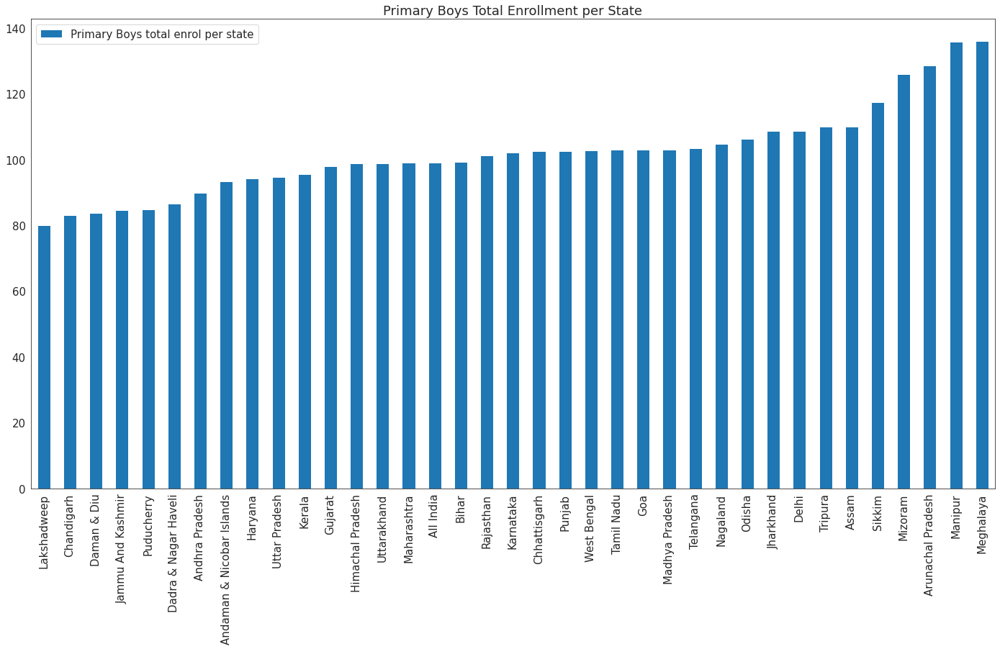  
  
 Lakshadweep state has the least enrollment of primary school boys, while Meghalaya state enrols the most primary school boys. 

  
Bar Chart of <b>Primary Girls Total Enrollement </b> per state 

  <!-- Provide path to the screenshot here-->
  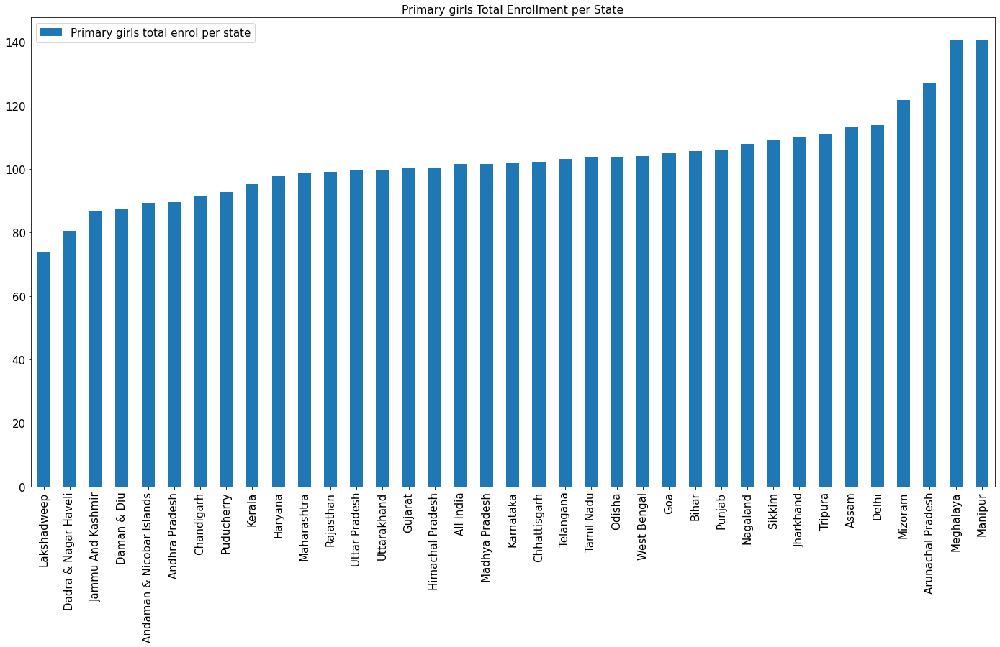  
  
 Lakshadweep state has the least enrollment of primary school girls, while Manipur state enrols the most primary school girls. 

  
Bar Chart of <b>Upper Primary Boys Total Enrollement </b> per state 

  <!-- Provide path to the screenshot here-->
  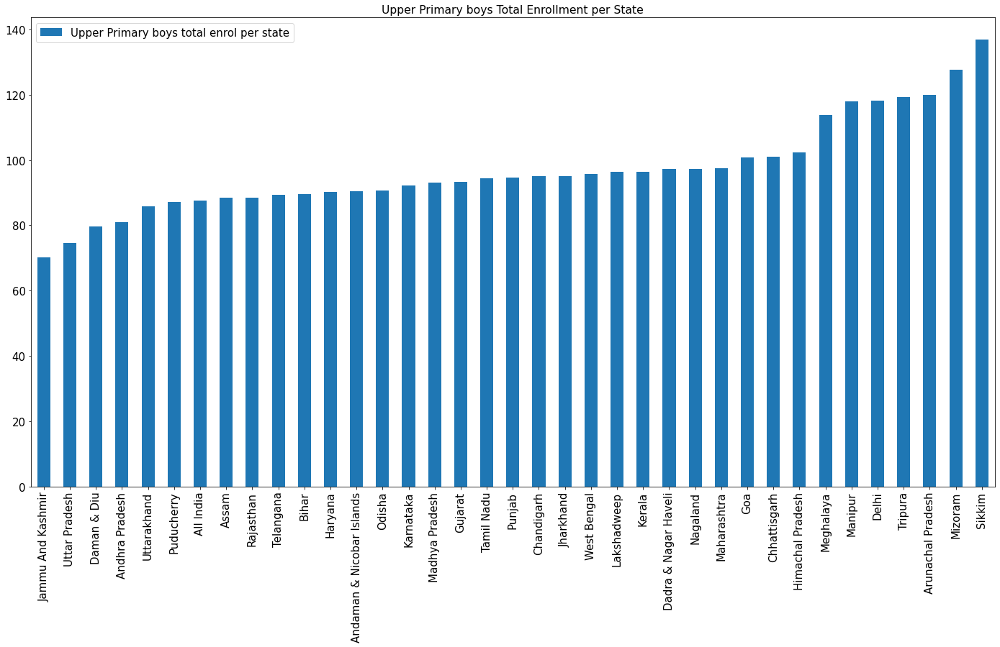  
  
 'Jammu and Kashmir' state has the least enrollment of Upper primary school boys, while Sikkim state enrols the most Upper primary school boys. 

  
Bar Chart of <b>Upper Primary Girls Total Enrollement </b> per state 

  <!-- Provide path to the screenshot here-->
  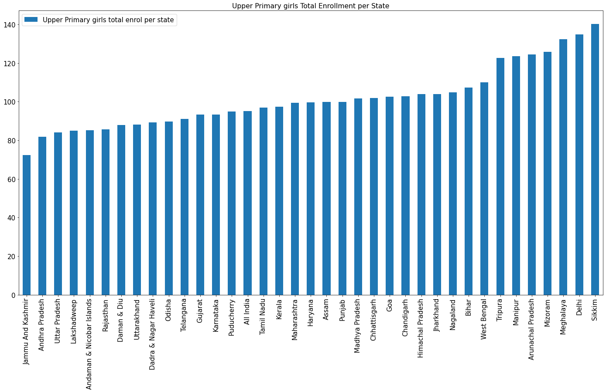  
  
 'Jammu And Kashmir' state has the least enrollment of Upper primary school girls, while Sikkim state enrols the most Upper primary school girls. 

  
Bar Chart of <b>Secondary Boys Total Enrollement </b> per state 

  <!-- Provide path to the screenshot here-->
  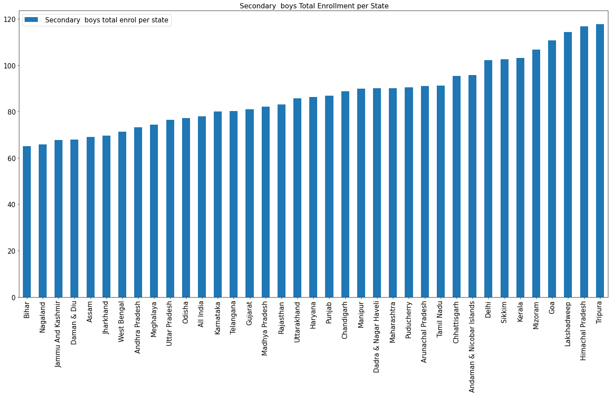  
  
 Bihar state has the least enrollment of Secondary school boys, while Tripura state enrols the most secondary school boys. 

  
Bar Chart of <b>Secondary Girls Total Enrollement </b> per state 

  <!-- Provide path to the screenshot here-->
  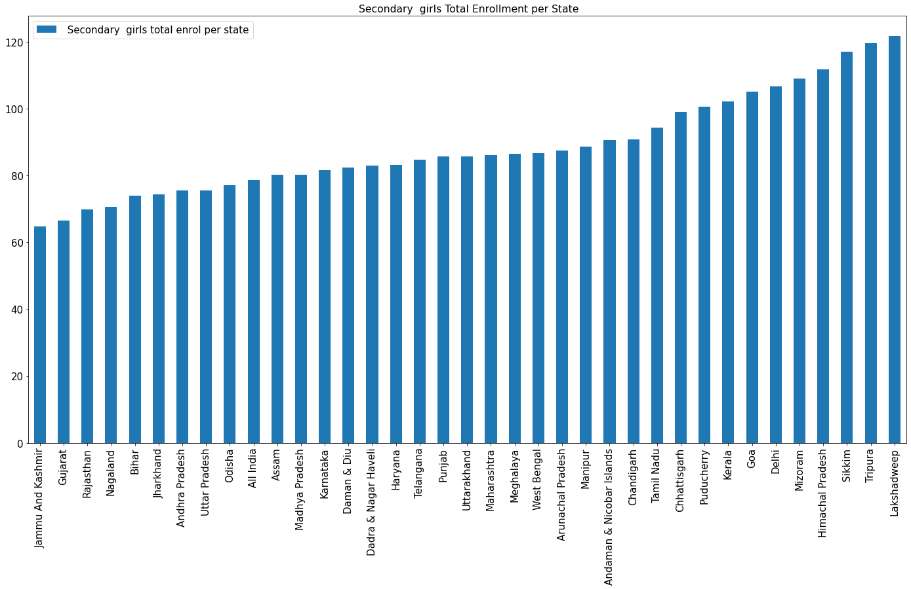  
  
 'Jammu And Kashmir' state has the least enrollment of Secondary school girls, while Lakshadweep state enrols the most Secondary school girls. 

  
Bar Chart of <b>Higher Secondary Boys Total Enrollement </b> per state 

  <!-- Provide path to the screenshot here-->
  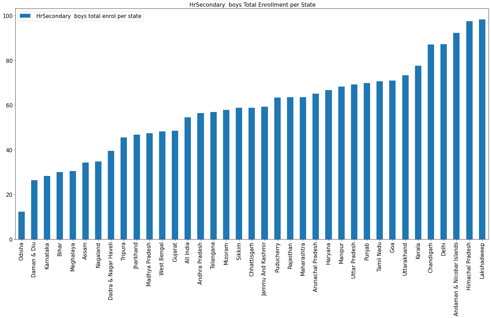  
  
 Odisha state has the least enrollment of Higher Secondary school boys, while Lakshadweep state enrols the most Higher Secondary school boys. 

  
Bar Chart of <b>Higher Secondary Girls Total Enrollement </b> per state 

  <!-- Provide path to the screenshot here-->
    
  
 Odisha state has the least enrollment for Higher Secondary girls, while 'Himachal Pradesh' has the highest enrollment of Higher Secondary girls 

<h2>Yearly Gross-Enrollment per gender of some selected states</h2>

 The interest_states were picked based on which states had high drop_out rate, gross enrollment, poor toilet facilities and all of india.

  
Bar Chart of <b>Boys Gross Enrollment</b> in <b> Delhi </b> 
 
  <!-- Provide path to the screenshot here-->
    

  
Bar Chart of <b>Girls Gross Enrollment</b> in <b> Delhi </b> 
 
  <!-- Provide path to the screenshot here-->
  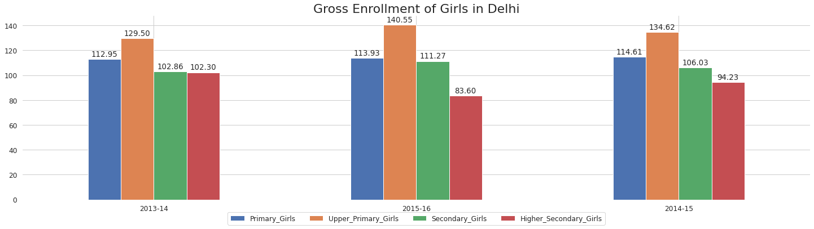  

  
Bar Chart of <b>Boys Gross Enrollment</b> in <b> 'Jammu And Kashmir' </b> 
 
  <!-- Provide path to the screenshot here-->
  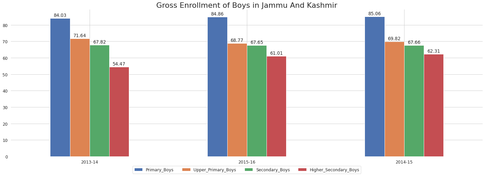  

  
Bar Chart of <b>Girls Gross Enrollment</b> in <b> 'Jammu And Kashmir' </b> 
 
  <!-- Provide path to the screenshot here-->
    

  
Bar Chart of <b>Boys Gross Enrollment</b> in <b> Mizoram </b> 
 
  <!-- Provide path to the screenshot here-->
  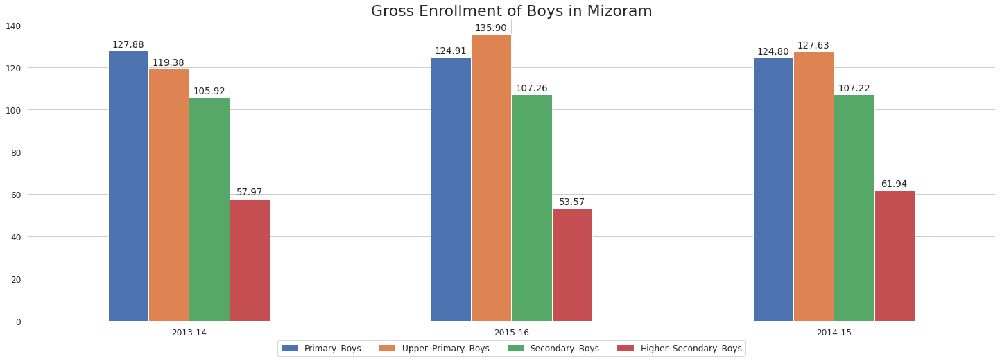  

  
Bar Chart of <b>Girls Gross Enrollment</b> in <b> Mizoram </b> 
 
  <!-- Provide path to the screenshot here-->
  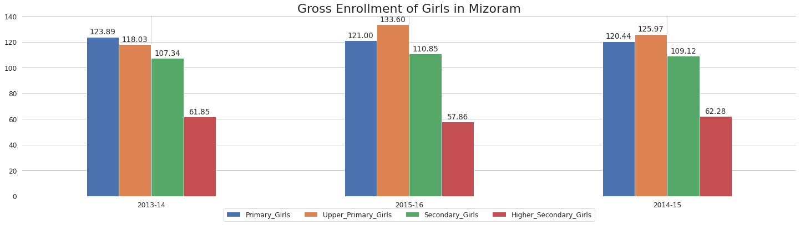  

  
Bar Chart of <b>Boys Gross Enrollment</b> in <b> Nagaland </b> 
 
  <!-- Provide path to the screenshot here-->
  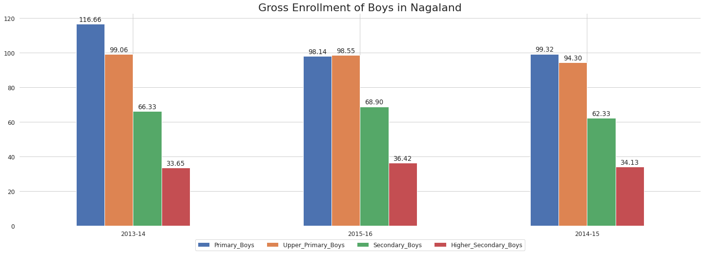  

  
Bar Chart of <b>Girls Gross Enrollment</b> in <b> Nagaland </b> 
 
  <!-- Provide path to the screenshot here-->
  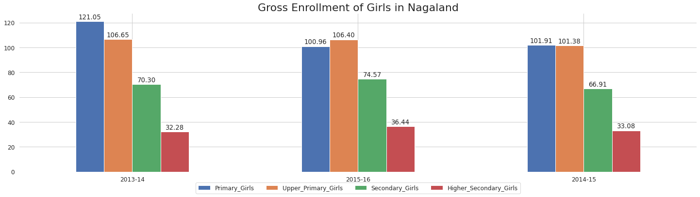  

  
Bar Chart of <b>Boys Gross Enrollment</b> in <b> 'All India' </b> 
 
  <!-- Provide path to the screenshot here-->
  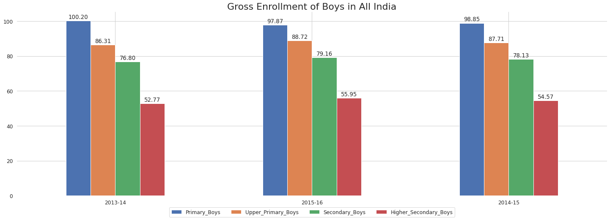  

  
Bar Chart of <b>Girls Gross Enrollment</b> in <b> 'All India' </b> 
 
  <!-- Provide path to the screenshot here-->
  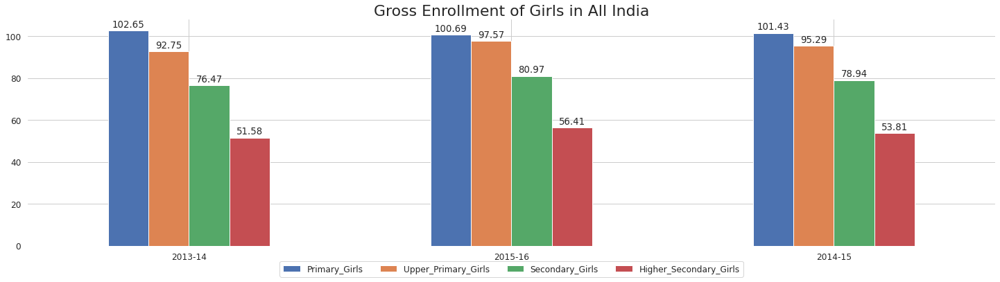  

