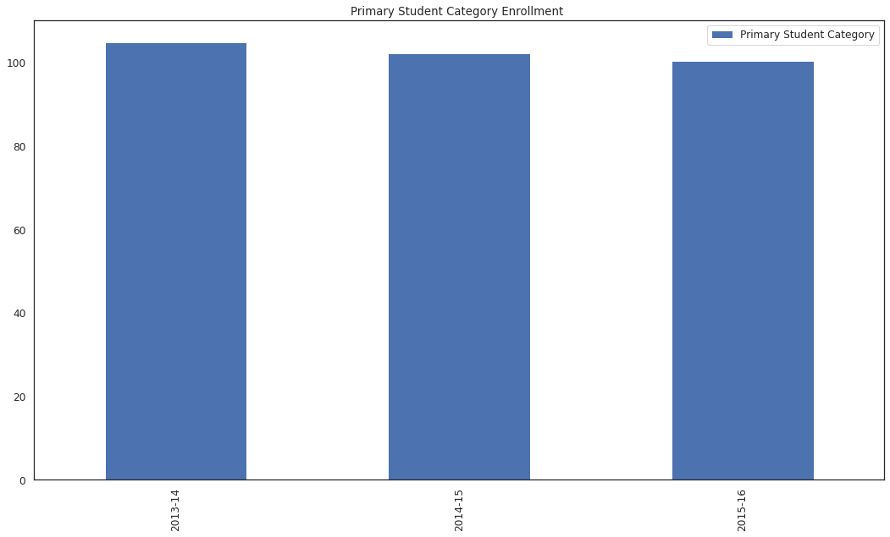
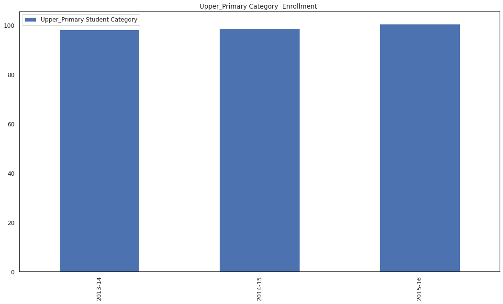
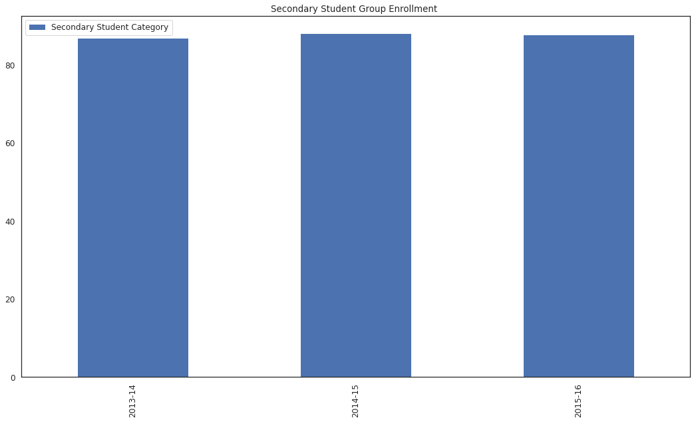
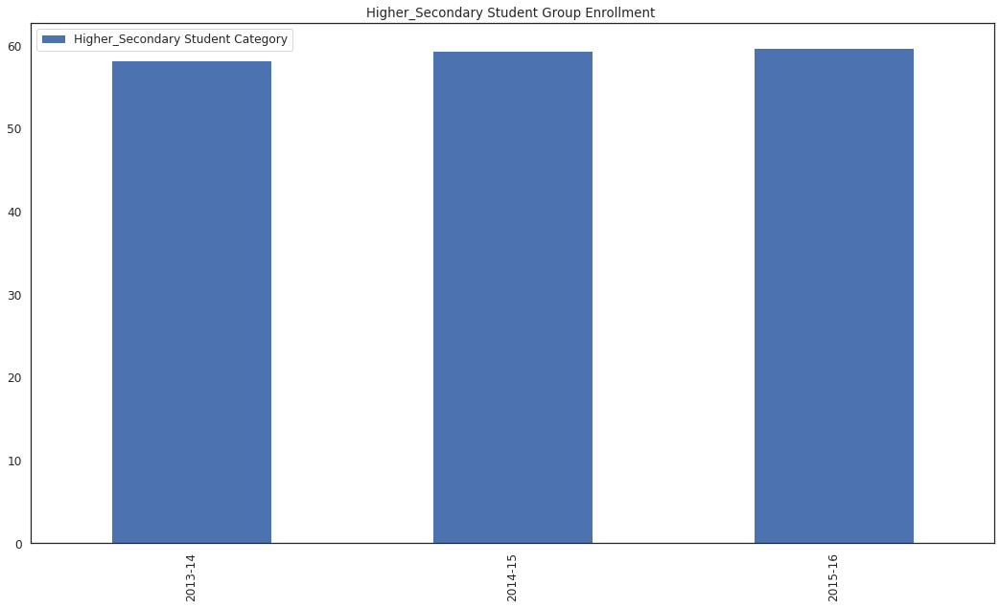

## Which level of school life is there less number of enrollment? Is it dropping or increasing?

Let's explore the Gross Enrollment Table from the Indian School Eduation [Dataset](https://www.kaggle.com/vidyapb/indian-school-education-statistics) and answer the question above.

  
Bar Chart of <b>Primary Student Category </b> over the 3 sessions 

  <!-- Provide path to the screenshot here-->
    
  
 From the above image we can see that the highest enrollment for primary session was during the 2013-14 session and further down the years, there's a little drop.

  
Bar Chart of <b>Upper Primary Student Category </b> over the 3 sessions 

  <!-- Provide path to the screenshot here-->
    
  
 From the above image, there's been a slow increase of enrollments in the upper_primary category from 2013 to 2016.

  
Bar Chart of <b>Secondary Student Category </b> over the 3 sessions 

  <!-- Provide path to the screenshot here-->
    
  
 From the above image, 2014-15 session is when the highest enrollment occured in the Secondary Student Category. 

  
Bar Chart of <b>Higher Secondary Student Category </b> over the 3 sessions 

  <!-- Provide path to the screenshot here-->
    
  
 From the above image, 2015-16 session is when the highest enrollment occured in the Higher Secondary Student Category. 

<h2> Higher Secondary level of school life has the least average number of enrollment, and the average number of enrollments over the 3 years only slightly increased. </h2>