## Do boys and girls have enough water and toilet facilities available?

Let's explore the Toilet Facilities Table from the Indian School Eduation [Dataset](https://www.kaggle.com/vidyapb/indian-school-education-statistics) and answer the question above.

  
Bar Chart of <b>Total Boys</b> Toilet facilities per State of <b> Sec_only students </b> 

  <!-- Provide path to the screenshot here-->
  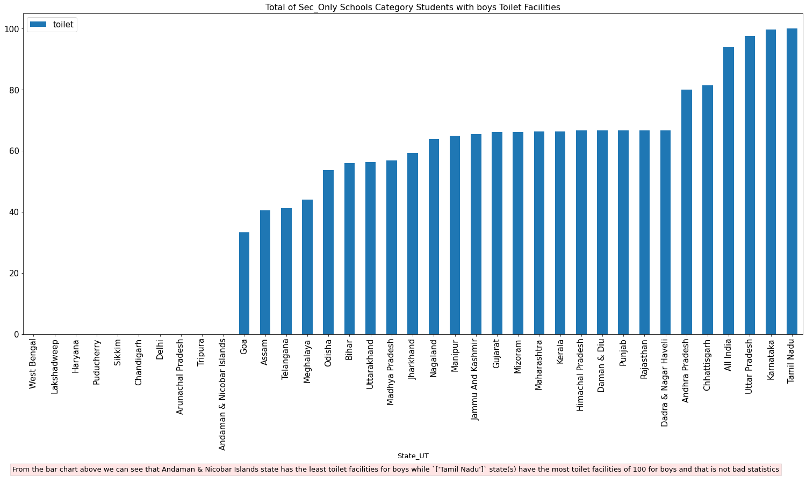  

  
Bar Chart of <b>Total Girls</b> Toilet facilities per State of of <b> Sec_only students </b>  

  <!-- Provide path to the screenshot here-->
  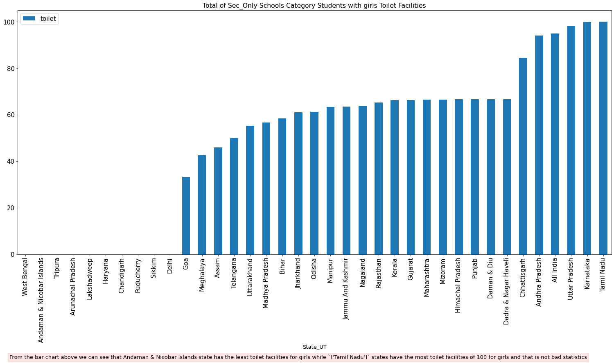  

 Both Male and Female <b> Sec_only students </b> did not have enough toilet facilities overall. 

<h2>Toilet Facilities for <b>Boys</b> per session. </h2> 

  
Bar Chart of <b>Total Boys</b> Toilet facilities in 2013-14

  <!-- Provide path to the screenshot here-->
  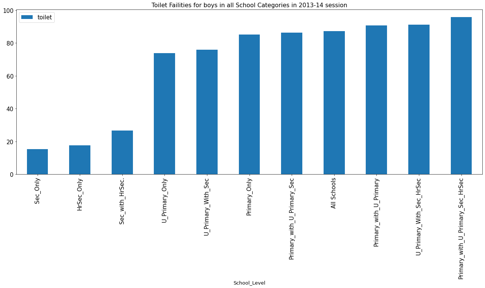  

  
 From the bar chart above we can clearly see that toilets facilities were scarce in secondary schools in 2013-14 session for boys

  
Bar Chart of <b>Total Boys</b> Toilet facilities in 2014-15

  <!-- Provide path to the screenshot here-->
  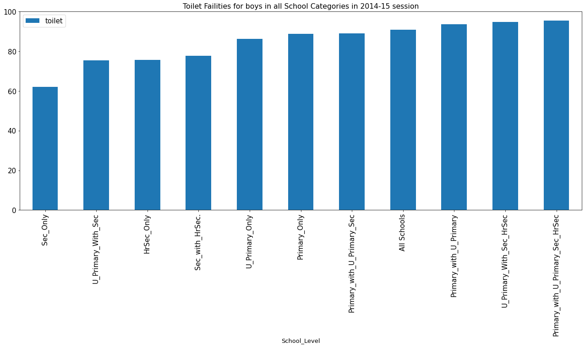  
  
 From the bar chart above we can see rapid rise in the toilets facilities of in secondary schools in 2014-15 session, compared to last session, this is a big improvement

  
Bar Chart of <b>Total Boys</b> Toilet facilities in 2015-16

  <!-- Provide path to the screenshot here-->
    
  
 There's little increase in the toilet facilities for secondary school students from previous year

 The sec_only students in all 3 years suffered the poorest toilet facilities for boys. 

<!-- Toilet Facilities for Girls -->
<h2>Toilet Facilities for <b>Girls</b> per session. </h2>

  
Bar Chart of <b>Total girls</b> Toilet facilities in 2013-14

  <!-- Provide path to the screenshot here-->
  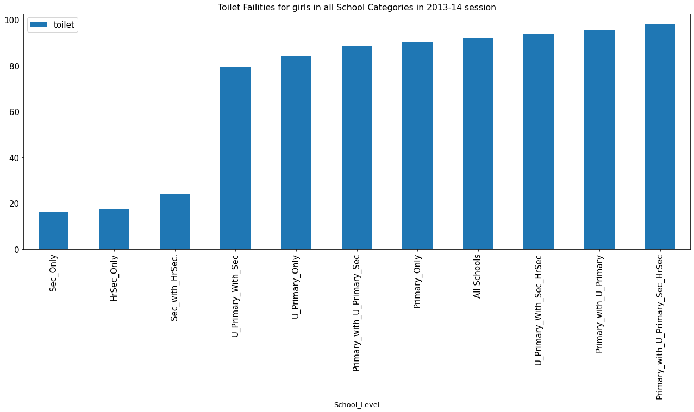  
  
 Same trend of insufficient toilet facilities for secondary school students in 2013-14 session.

  
Bar Chart of <b>Total girls</b> Toilet facilities in 2014-15

  <!-- Provide path to the screenshot here-->
  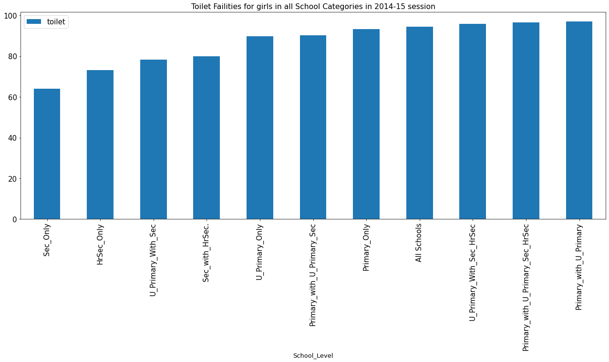  
  
 Also rapid increse in the toilet facilities in the secondary student category in the 2014-15 session.

  
Bar Chart of <b>Total girls</b> Toilet facilities in 2015-16

  <!-- Provide path to the screenshot here-->
  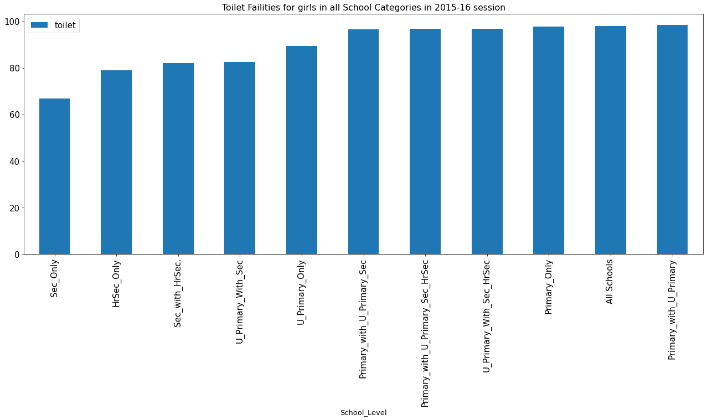  
  
 There's little increase in the toilet facilities of secondary school students from previous year

 The sec_only students in all 3 years suffered the poorest toilet facilities for girls. 

<!--- Toilet Facilities per state --->
<h2>Toilet Facilities for per state. </h2>

  
Bar Chart of <b>Total boys</b> Toilet facilities in all states

  <!-- Provide path to the screenshot here-->
  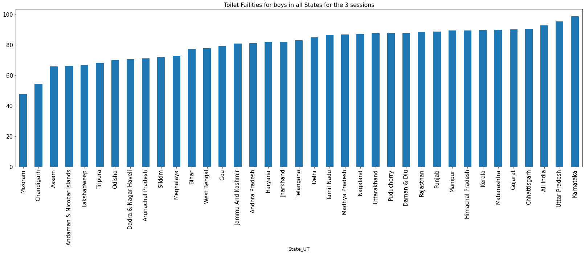  
  <h3> We can see clearly that 'Mizoram' state has the poorest toilet facilities and 'Kamataka' has the best toilet facilities for boys. </h3>

  
Bar Chart of <b>Total girls</b> Toilet facilities in all states

  <!-- Provide path to the screenshot here-->
  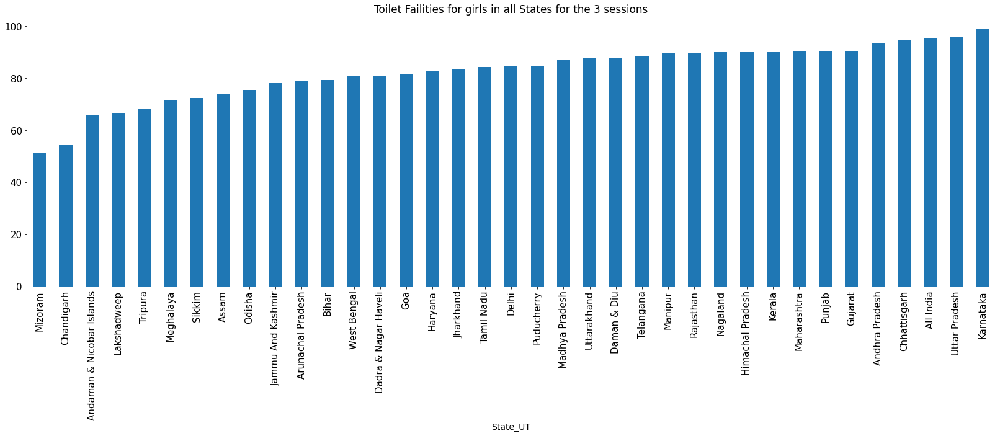  
  <h3> We can see clearly that 'Mizoram' state has the poorest toilet facilities and 'Kamataka' has the best toilet facilities for girls therefore we can conclude that Mizoram state had the overall poorest toilet facilities. </h3>

<h2> Exploration of the state with the Overall Poorest Toilet Facilities 'Mizoram' </h2>

  
Bar Chart of <b>Boys</b> Toilet facilities in Mizoram (2013-14)

  <!-- Provide path to the screenshot here-->
  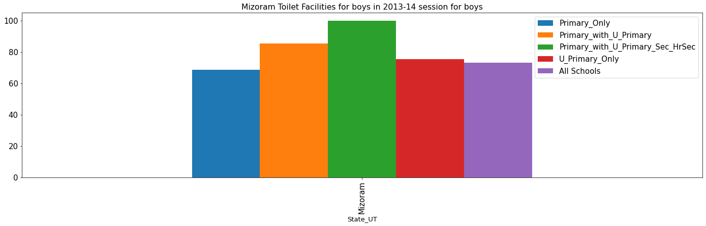  
  <h3> In 2013-14 session Primary_Only student category had the least toilet facility among the category types that had toilet facilities.<b> 6 other student categories had 0 toilet facilities this same year for boys.</b> </h3>

  
Bar Chart of <b>Boys</b> Toilet facilities in all Mizoram (2014-15)

  <!-- Provide path to the screenshot here-->
  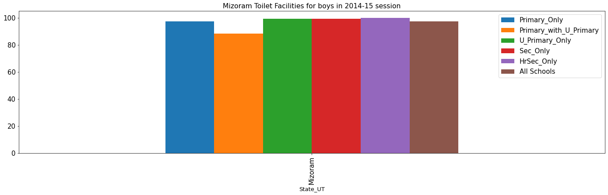  
  <h3> In 2014-15 session 'Primary_with_U_Primary' student category had the least toilet facility among the category types that had toilet facilities.<b> 5 other student categories had 0 toilet facilities this same year.</b> </h3>

  
Bar Chart of <b>Boys</b> Toilet facilities in all Mizoram (2015-16)

  <!-- Provide path to the screenshot here-->
  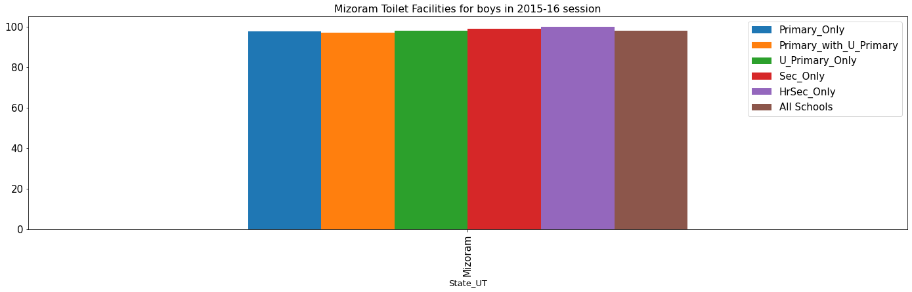  
  <h3> In 2015-16 session All displayed student category in the above chart have decent toilet facilities.<b> 5 other student categories had 0 toilet facilities this same year for boys.</b> </h3>

<!-- Girls -->

  
Bar Chart of <b>Girls</b> Toilet facilities in Mizoram (2013-14)

  <!-- Provide path to the screenshot here-->
  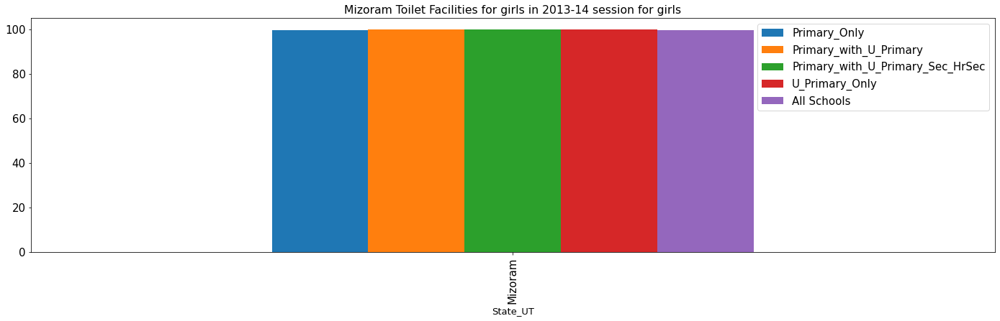  
  <h3> All the student categories that had toilet facilities had enough.<b> In this same year other 6 student categories had 0 toilet facilities.</b>
  
 The primary category for boys in this same year suffered to about 60, but it's a decent 99.xx for girls...
 </h3>

  
Bar Chart of <b>Girls</b> Toilet facilities in all Mizoram (2014-15)

  <!-- Provide path to the screenshot here-->
  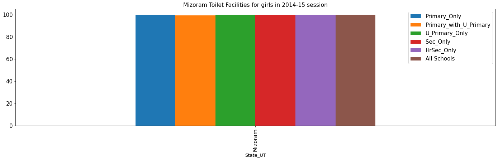  
  <h3> In 2014-15 session 'Primary_with_U_Primary' student category had the least toilet facility among the category types that had toilet facilities.<b> 5 other student categories had 0 toilet facilities this same year.</b> </h3>

  
Bar Chart of <b>Girls</b> Toilet facilities in all Mizoram (2015-16)

  <!-- Provide path to the screenshot here-->
  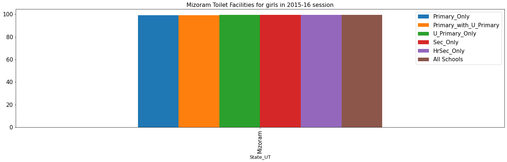  
  <h3> In 2015-16 session All displayed student category in the above chart have decent toilet facilities.<b> 5 other student categories had 0 toilet facilities this same year for girls.</b> </h3>

	 <blockquote>U_Primary_With_Sec is the student category with the most recurring Zeroes(0) of Toilet Facilities for both boys and girls through the 3 sessions in Mizoram state. </blockquote> 

