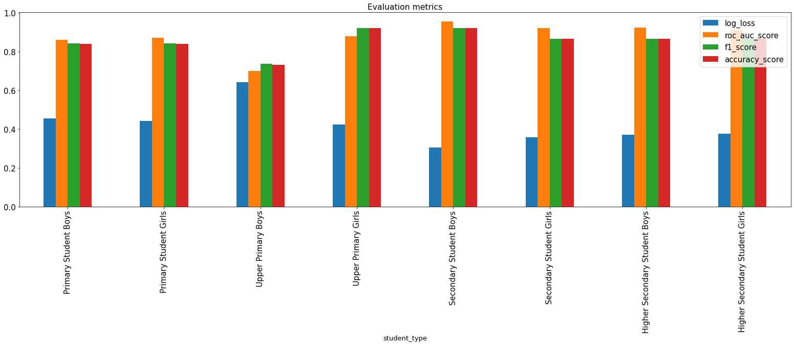
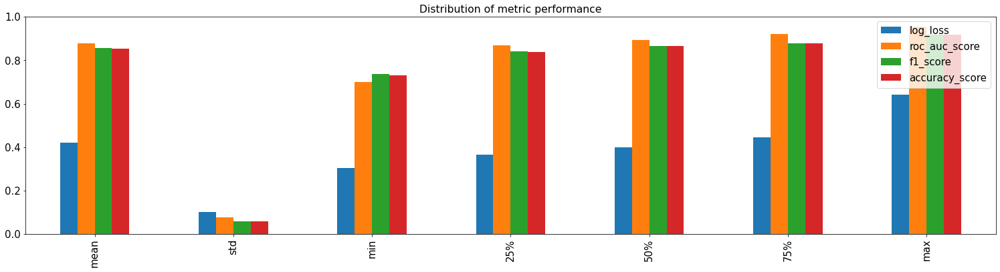

# Student Gross Enrollment ForeCast
## The Task is to use machine learning to forecast gross enrollment in 2015-16, using data of 2012-15 session, such as dropout rate, water and computer facilities. 
## In this notebook I approached the task as a classification problem and seperated the gross enrollment into 2 groups.

#### Approach 
* Joined Datasets
* Preprocessed Datasets
* Handled Missing Values 
* Treated Task as Binary Classification 
* KFold Validation
#### Improvements that can be made
* Feature Selection
* Feature Creation
* Hyper-parameter tuning
#### Requirements
- pip install requirements.txt

  
Bar chart of Metric Performance

  <!-- Provide path to the screenshot here-->
    

  

    <h4> From the chart above, we can see that predictions made for upper primary category is the weakest</h4>
  

  
Distribution of Metric Performance

  <!-- Provide path to the screenshot here-->
  s

If you have any questions, comments or concerns, feel free to reach me on [linkedin](https://www.linkedin.com/in/olukolatimi-david-19a841187/)
